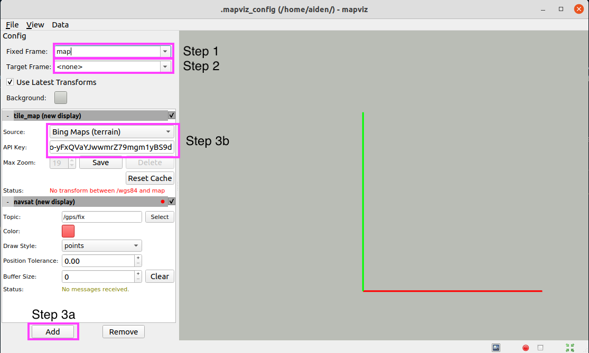
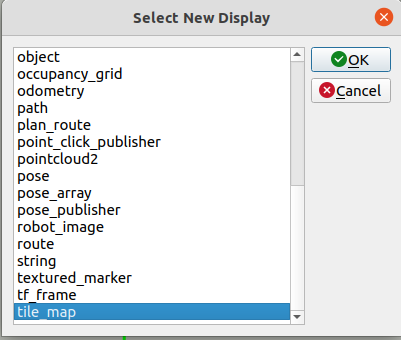
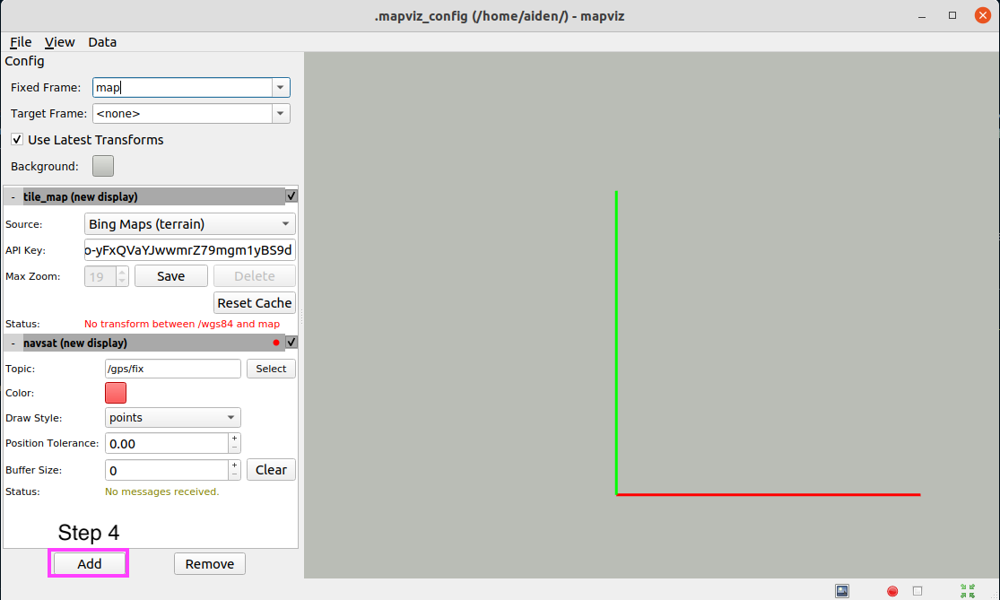
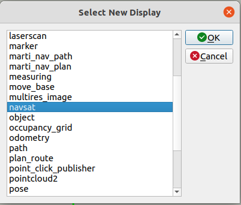
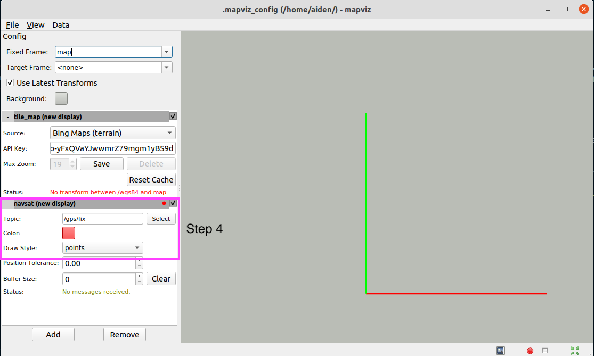

# wr_hsi_sensing

@defgroup wr_hsi_sensing wr_hsi_sensing
@brief Provides GPS data to the ROS network

This package contains nodes for the ArduSimple RTK GNSS board, a mapping node that maps the ArduSimple /gps/fix topic to a message used in our ROS environment, and a node for mapviz, a visualization tool.

There is also an old node "previous_gps_node.py" that was used when we were using an old GPS sensor to calculate IMU heading data as a temporary fix during a competition.
It is no longer used.

# Launching Nodes

## Setup
- Check which tty exists: `ls /dev/tty*`
- We'll need access to a file so run: `sudo chmod a+rw /dev/ttyACM0`

## Launching
To launch the ArduSimple/Ublox GPS node: `roslaunch wr_hsi_sensing ardusimple_provided.launch`
- To see all ros topics run: `rostopic list`
- To get info of a topic run: `rostopic info /gps/fix`
- To see all messages on a topic run: `rostopic echo /gps/fix`

To launch the mapping node: `roslaunch wr_hsi_sensing gps_data_mapper.launch`
- You'll need the ArduSimple/Ublox GPS node for this node to do anything

To lanch mapviz: `roslaunch wr_hsi_sensing mapviz.launch`
1. You'll need a BingMaps API key to get the satellite map layer 😭. Visit https://www.bingmapsportal.com/
2. Set fixed Frame to map in the upper left corner, set Target Frame to "none", and check use latest transforms.
3. Click Add at the bottom left to add tile_map. After that, set Source to BingMaps. Use the afforementioned API Key

4. Click Add again and add navsat. After that, click Select on Topic to load the topic set in remap (/gps/fix). After setting the color you like, change the draw style to point.

5. If you don't see the map, click the green arrow at the bottom right. Then, you can see a dot at your location.

---

OLD/DEPRECATED: The `hw_test.launch` file starts both the IMU and GPS sensing.  Currently, since the IMU logic was not run at competition, only the GPS node is started.
